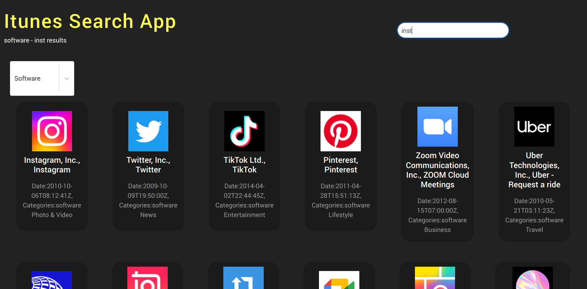
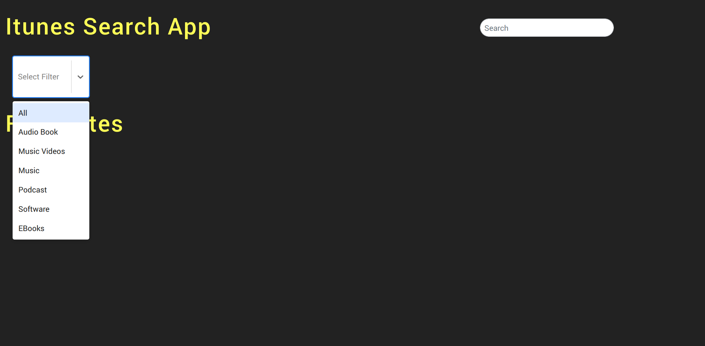
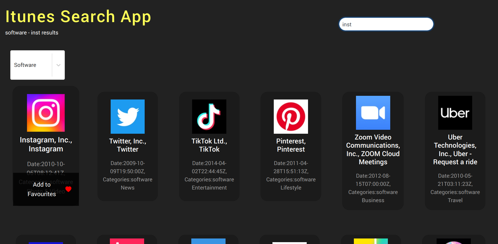
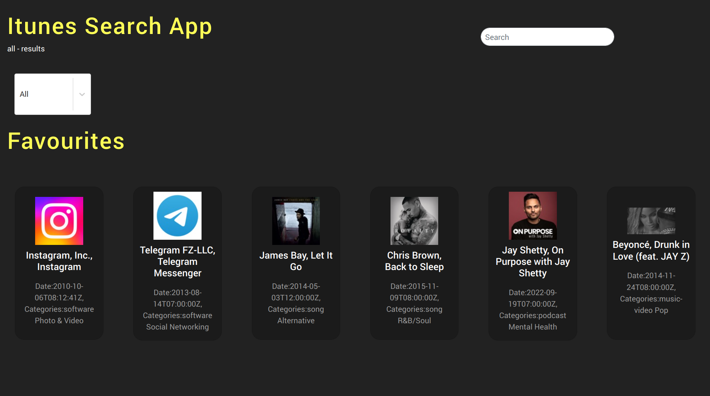
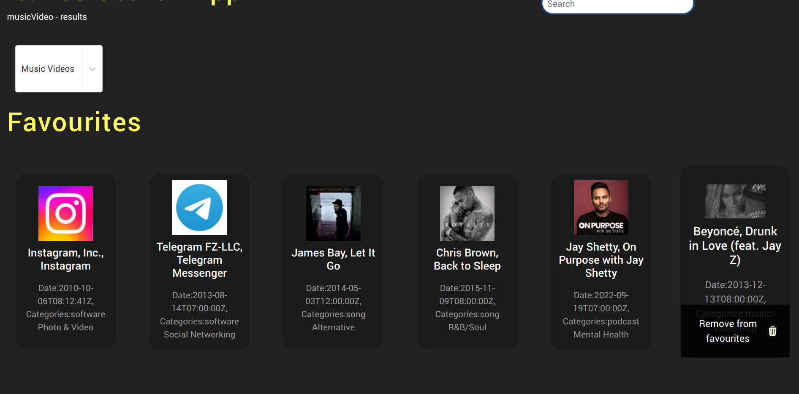

# Capstone Project 2 L2P21



> This project uses the itunes search api with express and react.

---

### Table of Contents

- [Description](#description)
- [How To Use](#how-to-use)
- [References](#references)
- [Author Info](#author-info)

---

## Description

The project allows a user to search itunes content using dynamic itunes search api queries controlled by the backend built with express using react for the frontend. The app also allows the user to add and remove favourites with alerts, loading a stylish dark ui for good user experience.

#### Technologies

- React
- React Toastify
- React Select
- Express
- Helmet
- itunes search API

[Back To The Top](#capstone-project-2-l2p21)

---

## How To Use

#### Installation

Clone or download this repository.

To install the server side of the project cd into the project directory itunesApp and run npm install.

To install the client side of the project cd into the client folder and run npm install.

#### API Reference

```html
<a
  href="https://developer.apple.com/library/archive/documentation/AudioVideo/Conceptual/iTuneSearchAPI/index.html#//apple_ref/doc/uid/TP40017632-CH3-SW1"
  >itunes search api documentation
</a>
```

### Step 1

On page load you will see an empty page displaying a search input, select filter and headings for the header and favourites section see example image below.


### Step 2

Select a search filter for the media you are looking for from the drop down, then type the name of an artist, software, book, podcast etc. using the input field see example image below.


### Step 3

As soon as you type three search keys the app will start searching for items matching the search value example image below.


### Step 4

Scroll up and down the page to view items and click on "Add to favourites" displayed on the item when you hover over the item, to add the item to your favourites example image below.


### Step 5

For easy access to your favourites section clear the search input field to remove search results from the page or scroll down till the end of your search results example image below.


### Step 6

To remove an item from favourites hover over the item and select "Remove from favourites" example image below.


[Back To The Top](#capstone-project-2-l2p21)

---

## References

- Website - [HyperionDev](https://www.hyperiondev.com/)
- Website - [itunes search API](https://developer.apple.com/library/archive/documentation/AudioVideo/Conceptual/iTuneSearchAPI/index.html#//apple_ref/doc/uid/TP40017632-CH3-SW1)

---

## Author Info

- linkedin - [@gauta-ncholo](https://www.linkedin.com/in/gauta-ncholo/)
- Website - [Gauta Ncholo Portfolio](https://therealblackgold.github.io/Gauta-Ncholo-Resume/)

[Back To The Top](#capstone-project-2-l2p21)
